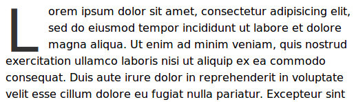
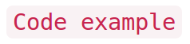
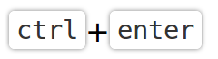

<h1 align="center">
  
</h1>

<h2 align="center">A minimal and simple typography template</h2>

### [Demo](http://filipelinhares.github.io/typ)

## Introduction
typ is a typography template and base style, built over the [sanitize-css][sanitize]

## Addons
- `.like-h[1~6]` - Alias class to `h1` and `h6` style.
- `.quote` - Alias class to the `blockquote` style.
- `.emphasis` - Alias class to the `em` style.
- `.bold` - Alias to the `strong` style.
- `.u-textBlur`
- `.u-dropcap`
- `.u-code`
- `.u-kbd`

### Examples
#### .u-textBlur
  
#### .u-dropcap
  
#### .u-code
  
#### .u-kdb
 .

## Configurations
- `$body-fontSize` : `16px !default`
- `$body-lineHeight` : `24px !default`
- `$debug` : `false !default`
- `$lists-detailedList-symbol` :`'‣' !default`
- `$fonts-textRendering` : `optimizeLegibility !default`
- `$fonts-small-size` : `75% !default`
- `$fonts-quotes` : `'“' '”' !default`
- `$links-textDecoration` : `none !default`

## Resources
- [CSS comments][comments]
- [SUIT][suit]
- [sanitize-css][sanitize]

[comments]: https://github.com/filipelinhares/css-comments
[suit]: https://github.com/suitcss/suit/blob/master/doc/README.md
[sanitize]: http://jonathantneal.github.io/sanitize.css/
## License
[MIT](LICENSE.md) © Filipe LInhares
