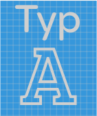

<h1 align="center">
  
</h1>

<h2 align="center">A minimal and simple typography template</h2>
[](https://travis-ci.org/filipelinhares/typ)

### [Demo](http://filipelinhares.github.io/typ)

## Installation
```sh
npm install typ-css
```

## Resources
- [CSS comments][comments]

[comments]: https://github.com/filipelinhares/css-comments

## License
[MIT](LICENSE.md) © Filipe Linhares
